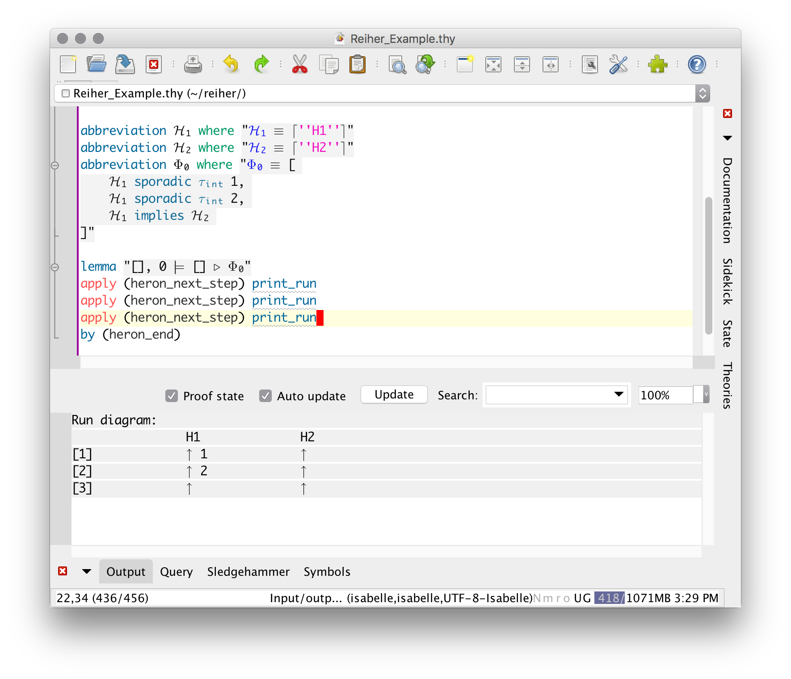

Reiher
===================

**Reiher** is a reimplementation prototype of [Heron](https://github.com/heron-solver/), a solver for the [Tagged Events Specification Language (TESL)](http://wwwdi.supelec.fr/software/TESL/). It is built on top of the generic proof assistant [Isabelle/HOL](http://isabelle.in.tum.de/).

