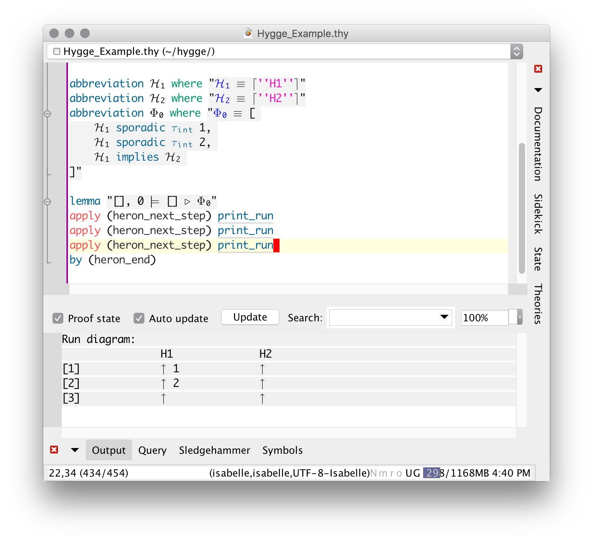

Hygge
===================

**Hygge** (pronounced [ˈhyɡ̊ə]) is a mechanization in the proof assistant [Isabelle/HOL](http://isabelle.in.tum.de/) of [Heron](https://github.com/heron-solver/heron), a solver for the [Tagged Events Specification Language (TESL)](http://wwwdi.supelec.fr/software/TESL/).

